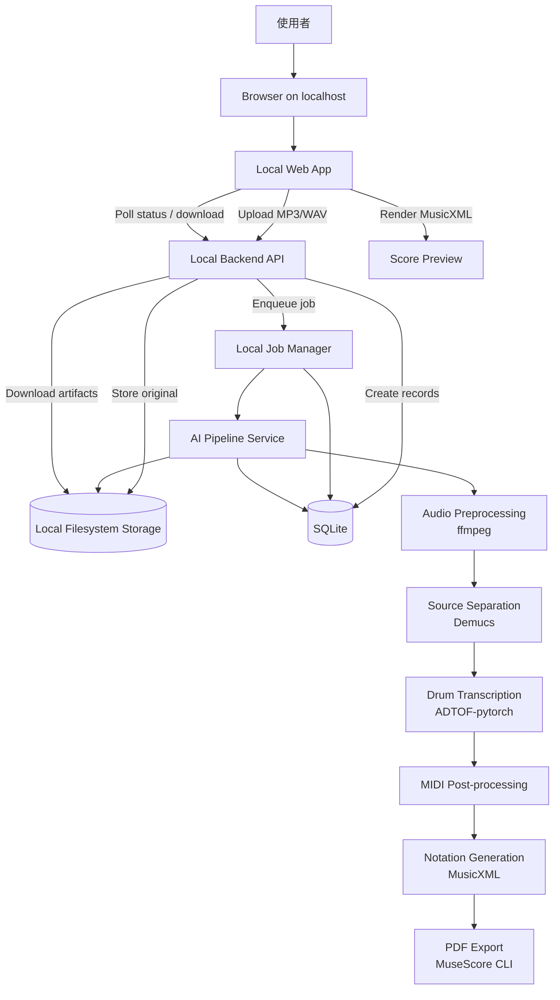
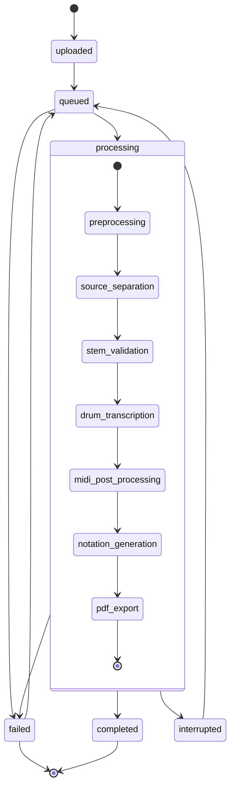

# GrooveScribe 系統架構

## 1. 整體系統架構

GrooveScribe V1 採用 Local Web App + 本機 Python pipeline 架構。使用者在自己的電腦上啟動服務，透過瀏覽器操作 localhost 介面；後端、database、job manager、AI runtime 與 artifacts storage 都在本機執行。

V1 預設不依賴雲端服務、不依賴 Redis / Celery、不依賴 PostgreSQL、不依賴 S3。這些能力可作為 future / optional server mode。

核心元件：

- Local Web App
- Local Backend API
- SQLite Database
- Local Job Manager
- AI Pipeline Service
- Local Filesystem Storage
- Notation / Export Service
- Runtime Preflight / Diagnostics

## 2. 責任分工

### 2.1 Local Web App

責任：

- 提供上傳介面。
- 呼叫本機 backend API。
- 導向 job result page。
- 輪詢 job status。
- 顯示 progress、stage、warnings、error、preview。
- 提供 MIDI / MusicXML / PDF 下載入口。
- 顯示 runtime preflight 或 pipeline warning。

Frontend 不直接執行音訊分析，不直接讀取任意 filesystem path。所有 artifacts 透過 backend download / preview API 取得。

### 2.2 Local Backend API

責任：

- 驗證上傳檔案格式與大小。
- 建立 `AudioFile`、`TranscriptionJob`。
- 將原始檔案寫入 local storage。
- 將 job 交給 local job manager。
- 提供 job status / result / download API。
- 提供 runtime diagnostics / app health API。
- 將內部錯誤轉換成穩定 API response。

Backend API 不直接在 request lifecycle 中執行 Demucs 或 ADTOF-pytorch。

### 2.3 Local Job Manager

責任：

- 管理本機 job queue。
- 控制同時執行數，V1 預設一次執行一個 AI pipeline job。
- 更新 queued / processing / completed / failed 狀態。
- 在 service restart 後偵測 stale processing job，標示為 failed、interrupted 或可重新執行。
- 記錄 job started_at、completed_at、failed_at、elapsed time。
- 提供取消、重試、重新執行的擴充點。

V1 job manager 可以先是 in-process / single-process implementation，但 interface 需要保留未來替換 Redis / Celery 的可能。

### 2.4 AI Pipeline Service

責任：

- 音檔標準化。
- Source separation。
- Drum transcription。
- MIDI post-processing。
- MusicXML / PDF generation。
- Stage report 與 artifact metadata 產生。

AI pipeline 應透過 interface 呼叫模型 adapter，避免 API、job manager 或 database model 直接依賴 Demucs / ADTOF-pytorch。

### 2.5 SQLite Database

責任：

- 保存 audio file metadata。
- 保存 transcription job status。
- 保存 drum track summary。
- 保存 export file metadata。
- 保存 pipeline version、runtime metadata、error summary。

SQLite 不保存大型 audio / MIDI / PDF blob；大型檔案一律放 local filesystem storage。

### 2.6 Local Filesystem Storage

責任：

- 保存 original audio。
- 保存 normalized audio。
- 保存 drums stem。
- 保存 raw MIDI、processed MIDI、drum events JSON。
- 保存 MusicXML、PDF。
- 保存 pipeline logs 與 stage reports。

Storage 必須在 app data / workspace root 下運作，不應暴露任意本機路徑給前端。

## 3. 資料流

```text
User opens localhost
→ Local Web App
→ POST /api/v1/transcriptions
→ Local storage: original audio
→ SQLite: AudioFile + TranscriptionJob
→ Local Job Manager: enqueue job_id
→ AI Pipeline Service
→ Local storage: normalized.wav
→ Local storage: drums.wav
→ Local storage: raw_drum.mid
→ Local storage: processed_drum.mid
→ Local storage: drum_events.json
→ Local storage: score.musicxml
→ Local storage: score.pdf
→ Local storage: pipeline.json
→ SQLite: DrumTrack + ExportFile records + status
→ Local Web App Result Page
```

## 4. 音訊處理流程

```text
original.mp3 / original.wav
→ ffmpeg normalize
→ normalized.wav
→ Demucs source separation
→ drums.wav
→ drums stem validation
→ ADTOF-pytorch transcription
→ raw_drum.mid
```

標準化建議：

- WAV PCM。
- mono 或 stereo 視模型需求統一設定。
- 44.1 kHz 或模型建議取樣率。
- normalized loudness 可列為 V1 quality enhancement；最小要求是 format normalization 與明確 metadata。

## 5. MIDI / MusicXML / PDF 產生流程

```text
raw_drum.mid
→ parse MIDI events
→ tempo alignment
→ quantization
→ drum note mapping
→ event cleanup
→ processed_drum.mid
→ drum_events.json
→ score.musicxml
→ PDF renderer
→ score.pdf
```

重要設計：

- `raw_drum.mid` 需保留，方便 debug 模型輸出。
- `processed_drum.mid` 是使用者下載的主要 MIDI。
- `drum_events.json` 是 notation 與 regression debug 的中間格式。
- `score.musicxml` 是網頁預覽與 PDF 轉換的主要譜面來源。
- `score.pdf` 是 MusicXML 的衍生檔；PDF 失敗不應讓 MIDI / MusicXML 失效。

## 6. 模組邊界

系統應以以下邊界拆分：

- UI layer：Local Web App、狀態呈現、預覽、下載。
- API layer：HTTP、validation、response、download stream。
- Domain layer：job、audio file、export file、status transition。
- Persistence layer：SQLite repositories / migrations。
- Storage layer：local filesystem adapter，future S3 adapter。
- Job layer：local job manager，future Redis / Celery adapter。
- Pipeline layer：stage orchestration。
- Model adapters：ffmpeg、Demucs、ADTOF、future Omnizart / custom model。
- Notation layer：MIDI event to notation model、MusicXML、PDF。
- Diagnostics layer：runtime preflight、pipeline log reader、error summaries。

任何一個 AI 模型不應直接出現在 API controller 或 database model 中。

## 7. 可擴充設計

### 7.1 替換 AI 模型

定義 interface：

- `AudioPreprocessor.normalize(input_audio) -> NormalizedAudio`
- `SourceSeparator.separate(input_audio) -> StemSet`
- `DrumTranscriber.transcribe(drums_audio) -> RawMidi`
- `MidiPostProcessor.process(raw_midi) -> ProcessedMidi`
- `NotationGenerator.generate(events) -> MusicXml`
- `PdfExporter.export(musicxml) -> PdfExportResult`

Demucs 與 ADTOF-pytorch 只是 V1 adapter 實作。未來可加入：

- Demucs fork / alternative source separation model
- Omnizart drum transcription
- 自訓 drum transcription model
- Ensemble / fallback transcriber

### 7.2 替換儲存服務

V1 預設：

- Local filesystem storage under app data / workspace root。

Future optional：

- S3-compatible storage。
- Cloud sync storage。

Storage interface：

- `put_artifact(job_id, artifact_type, stream) -> ArtifactRef`
- `get_artifact(ref) -> stream`
- `artifact_exists(ref) -> bool`
- `delete_artifact(ref) -> None`

### 7.3 替換 Job Manager

V1 預設：

- 本機 job manager。
- 單機 queue。
- 預設 concurrency = 1。

Future optional：

- Celery + Redis。
- RQ / Dramatiq。
- Server-side worker pool。
- GPU worker queue。

業務邏輯不應直接依賴 Celery task object。

### 7.4 Desktop Shell

V1 使用 Local Web App，保留未來 shell：

- Tauri shell：包裝 localhost service 與前端。
- Electron shell：提供跨平台桌面封裝。

桌面 shell 不應改變 V1 的核心 domain、pipeline、storage 與 job manager 邊界。

## 8. 架構圖



## 9. 狀態流轉圖



## 10. Future Server Mode

Server deployment 可在 V1 之後獨立設計。可選替換：

- SQLite → PostgreSQL。
- Local job manager → Redis / Celery。
- Local filesystem → S3-compatible storage。
- Local browser-only use → hosted frontend / multi-user API。

這些不是 V1 預設，不應影響 local-first app 的完成標準。
