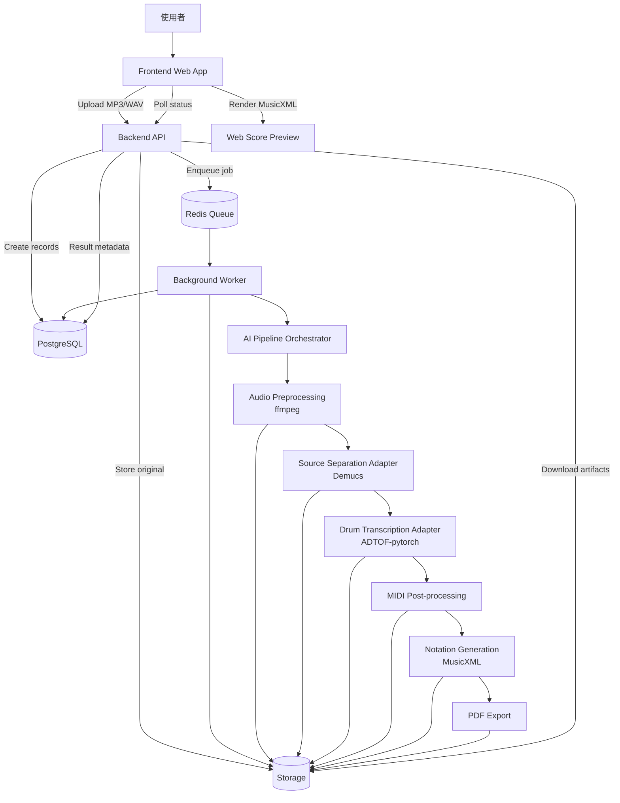
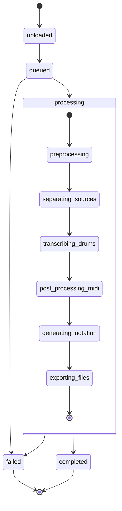

# GrooveScribe 系統架構

## 1. 整體系統架構

GrooveScribe 採用 API-first + background worker 架構。API server 不執行耗時音訊分析，只負責建立任務、驗證權限、查詢狀態、回傳結果。AI pipeline 在 worker 中執行，並透過資料庫與檔案儲存層回寫狀態與 artifacts。

核心元件：

- Frontend Web App
- Backend API Server
- Database
- Job Queue
- Background Worker
- AI Pipeline
- Storage Service
- Notation / Export Service

## 2. 責任分工

### 2.1 Frontend

責任：

- 提供上傳介面。
- 呼叫 upload API。
- 導向 job result page。
- 輪詢 job status。
- 顯示 progress、error、preview。
- 提供 MIDI / MusicXML / PDF 下載入口。

Frontend 不直接執行音訊分析，不直接讀取內部 storage path。

### 2.2 Backend API

責任：

- 驗證上傳檔案格式與大小。
- 建立 `AudioFile`、`TranscriptionJob`。
- 將原始檔案寫入 storage。
- 將 job 推送到 queue。
- 提供 job status / result / download API。
- 將內部錯誤轉換成穩定 API response。

Backend API 不直接呼叫 Demucs 或 ADTOF-pytorch。

### 2.3 Worker

責任：

- 從 queue 接收 job。
- 執行完整 pipeline。
- 每個 stage 寫入 progress 與 artifacts。
- 捕捉錯誤並更新 job failed。
- 產生輸出檔 metadata。

### 2.4 AI Pipeline

責任：

- 音檔標準化。
- Source separation。
- Drum transcription。
- MIDI post-processing。
- MusicXML / PDF generation。

AI pipeline 應透過 interface 呼叫模型 adapter，避免業務邏輯直接依賴 Demucs / ADTOF-pytorch。

## 3. 資料流

```text
User Upload
→ Backend API
→ Storage: original audio
→ Database: AudioFile + TranscriptionJob
→ Queue: transcribe_audio(job_id)
→ Worker
→ Storage: normalized.wav
→ Storage: drums.wav
→ Storage: raw.mid
→ Storage: processed.mid
→ Storage: score.musicxml
→ Storage: score.pdf
→ Database: DrumTrack + ExportFile records
→ Frontend Result Page
```

## 4. 音訊處理流程

```text
original.mp3 / original.wav
→ ffmpeg normalize
→ normalized.wav
→ Demucs source separation
→ drums.wav
→ drums stem validation
→ ADTOF-pytorch transcription
→ raw_drum.mid
```

標準化建議：

- WAV PCM
- mono 或 stereo 視模型需求統一設定
- 44.1 kHz 或模型建議取樣率
- normalized loudness 可列為後續優化，MVP 先做 format normalization

## 5. MIDI / MusicXML / PDF 產生流程

```text
raw_drum.mid
→ parse MIDI events
→ tempo alignment
→ quantization
→ drum note mapping
→ event cleanup
→ processed_drum.mid
→ notation event model
→ score.musicxml
→ render/export
→ score.pdf
```

重要設計：

- `raw_drum.mid` 需保留，方便 debug 模型輸出。
- `processed_drum.mid` 是使用者下載的主要 MIDI。
- `score.musicxml` 是網頁預覽與 PDF 轉換的來源。
- `score.pdf` 是 MusicXML 的衍生檔。

## 6. 模組邊界

系統應以以下邊界拆分：

- API layer：HTTP、auth、validation、response。
- Domain layer：job、audio file、export file、status transition。
- Storage layer：local / S3 adapter。
- Queue layer：enqueue / consume task。
- Pipeline layer：stage orchestration。
- Model adapters：Demucs adapter、ADTOF adapter、future Omnizart adapter。
- Notation layer：MIDI event to notation model、MusicXML、PDF。

任何一個 AI 模型不應直接出現在 API controller 或 database model 中。

## 7. 可擴充設計

### 7.1 替換 AI 模型

定義 interface：

- `SourceSeparator.separate(input_audio) -> StemSet`
- `DrumTranscriber.transcribe(drums_audio) -> RawMidi`

Demucs 與 ADTOF-pytorch 只是 adapter 實作。未來可加入：

- Demucs fork / alternative source separation model
- Omnizart drum transcription
- 自訓 drum transcription model
- Ensemble / fallback transcriber

### 7.2 替換儲存服務

定義 interface：

- `put_artifact(job_id, artifact_type, stream) -> ArtifactRef`
- `get_artifact(ref) -> stream`
- `create_download_url(ref) -> URL`

Local filesystem 與 S3-compatible storage 都實作同一套 interface。

### 7.3 拆分 worker

MVP 可使用單一 worker。未來可拆分：

- audio preprocessing queue
- GPU source separation queue
- GPU drum transcription queue
- notation export queue
- cleanup queue

## 8. 架構圖



## 9. 狀態流轉圖


